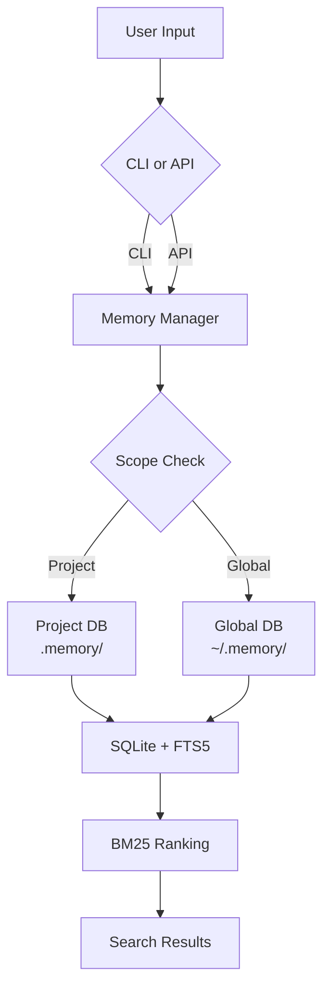

# OpenMem

# Project-level Memory system for AI-powered development.

## Why OpenMem?

**The Problem We Solved**

While using AI-powered development tools like OpenClaw, we experienced a critical issue: **important conversations and decisions were frequently lost**. The trigger-based memory system missed crucial context daily - technical decisions, problem-solving insights, and creative breakthroughs disappeared into the void.

**Our Development Environment Has Evolved**

The IDE is no longer just a code editor. It's become our **primary workspace** where we:
- Discuss architecture with AI
- Debug complex problems  
- Capture fleeting insights
- Make critical technical decisions

Only polished outcomes become documentation (MD/Word/PDF). But the **golden moments** - the sparks of insight during live problem-solving - deserve to be preserved too.

**Our Solution: Full Recording + Smart Organization**

Instead of relying on imperfect triggers, we record **everything** and organize intelligently. This approach:
- ✅ Never misses important context
- ✅ Captures the complete thinking process
- ✅ Turns conversations into actionable knowledge
- ✅ Works across all development scenarios

**Four Usage Scenarios**

1. **IDE Integration** (Trae / VS Code) - Your daily driver
2. **Code Editor** - Lightweight editing sessions  
3. **CLI Tools** - Command-line development
4. **AI Assistant** (OpenClaw) - Enhanced memory for your AI partner

**Why We Built This**

We're developers who faced the same pain point. After replacing our own OpenClaw memory with this system and seeing dramatic improvements, we knew we had to share it.

**Learn from OpenClaw, Evolve Beyond**

OpenClaw showed us the way. We're continuing that evolution - breaking context limitations, preserving knowledge, and making every conversation count.

---

## Features

- 🎯 **Project-level Memory** - Independent memory space per project
- 🔍 **Full-text Search** - Chinese tokenization (jieba) + FTS5 + BM25 ranking
- 🌐 **Global/Project Layers** - Flexible like Poetry
- 📦 **Template Init** - minimal / standard / full
- ⚙️ **Config Inheritance** - extends global config
- 📝 **Rules Generation** - Auto-generate IDE-readable rules
- 🔒 **Encrypted Backup** - Local encrypted storage (future)
- ⏮️ **Version Control** - Git-like versioning (future)
- 🖥️ **IDE Support** - Trae IDE + VS Code

---

## Security & Privacy

**Data Storage**
- All data is stored **locally** on your machine
- Raw data in SQLite database (plain text for fast FTS5 search)
- **No data is ever sent to external servers**

**Backup**
- Encrypted backup feature is planned for future release
- Encryption algorithm: Fernet (symmetric encryption)
- Key management: User-provided passphrase

**Privacy**
- Zero network requests by default
- Your data stays on your machine
- You control when and how to share

---

## Current Status

| Feature | Status | Notes |
|:---|:---:|:---|
| CLI (init/add/search/list/status) | ✅ Done | Core commands working |
| Project/Global layers | ✅ Done | Like Poetry config |
| Full-text search (FTS5 + BM25) | ✅ Done | jieba for Chinese |
| Config inheritance | ✅ Done | extends global config |
| Template init | ✅ Done | minimal/standard/full |
| Python API | ✅ Done | from openmem import |
| Encrypted backup | 🔜 Planned | v0.2 |
| Git-like version control | 🔜 Planned | v0.2 |
| IDE rules auto-generation | 🔜 In Progress | Trae/VS Code support |
| LLM summarization | 🔜 Planned | v0.3 |

---

## Architecture



**Data Flow:**
1. User input via CLI or Python API
2. Memory Manager routes to Project or Global layer
3. Data stored in local SQLite with FTS5 index
4. Search uses BM25 for relevance ranking

---

## Installation

```bash
pip install openmem
```

Or development mode:

```bash
pip install -e .
```

## Quick Start

### Initialize

```bash
# Project-level Memory
omem init

# Global Memory (shared across projects)
omem init --global

# Select template
omem init --template=standard
omem init --template=full

# Non-interactive mode
omem init -y
```

### Basic Usage

```bash
# Add memory
omem add "Use JWT for authentication" --type decision --tags auth,security

# Search
omem search auth
omem search auth --scope both

# List
omem list --type decision

# Status
omem status
omem status -v
```

### Python API

```python
from openmem import MemoryManager

# Auto-select (project first, fallback to global)
memory = MemoryManager()

# Explicit project path
memory = MemoryManager(project_path="/path/to/project")

# Global memory only
memory = MemoryManager(project_path=None)

# Add memory
memory_id = memory.add(
    content="Use JWT for authentication",
    type="decision",
    tags=["auth", "security"],
    priority=8
)

# Search with filters
results = memory.search(
    query="authentication",
    scope="project",      # "project" | "global" | "both"
    memory_type="decision",
    tags=["auth"],
    limit=10
)

# List memories
memories = memory.list(
    memory_type="decision",
    tags=["auth"],
    limit=50
)

# Update and delete
memory.update(memory_id, content="New content")
memory.delete(memory_id)

memory.close()
```

## Documentation

- [Quick Start Guide](QUICKSTART.md)
- [Usage Guide](USAGE.md)
- [Architecture](ARCHITECTURE.md)
- [Philosophy](PHILOSOPHY.md)
- [Contributing](CONTRIBUTING.md)
- [Changelog](CHANGELOG.md)

---

## License

MIT
